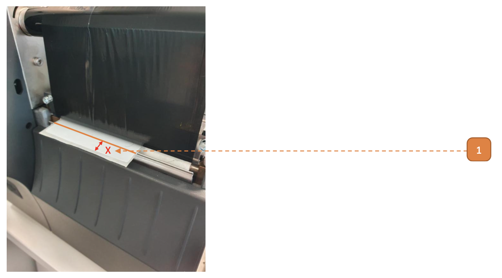
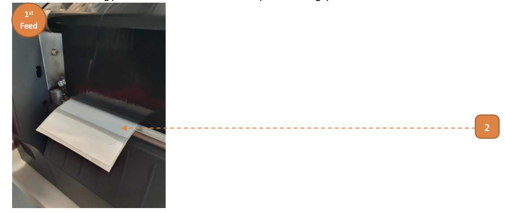
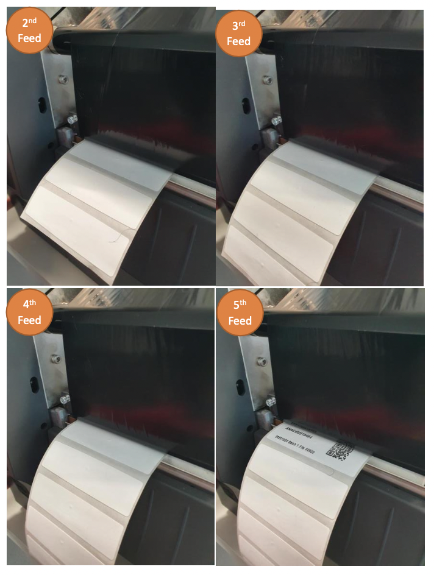

# Perform Feeding

## How do I Perform Feeding?

The **purpose** of feeding is to:
- Check the calibration results
- Ensure that label is spooled one at a time
- Zeroise from the user adjusted tag position to the **printer default stop position**.

1. Note the tag position **"X"** to the reference line (in solid orange).

2. Select **Feed** button once, one tag will be spooled out.

3. Proceed to select the **Feed** button several times, this should correspond with the number of tages spooled.
- If **Feed** button spools irregular/unusual lengths, please restart from [Media Calibration](410MediaCali).

4. By the 6th feed, note tag position has been zeroised.
In this example, the line now rests around the start of the tag.
This is the **printer default stop position**.
Note that:
- If calibration has been done prior to this, tag position should not change.
- **Printer default stop position** may vary from one calibration to another. 
It is recommended to take a snapshot for reference.

- In this example 6 feeds were required, mileage may vary. 
**Printer default stop position** should be obtained under 10 feeds. If this is not the case, please restart from [Media Calibration](410MediaCali).

