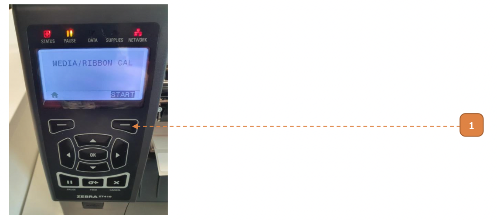
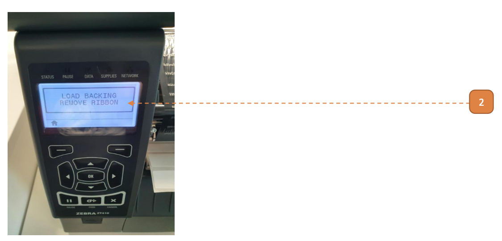
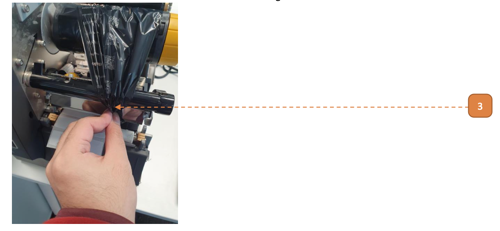
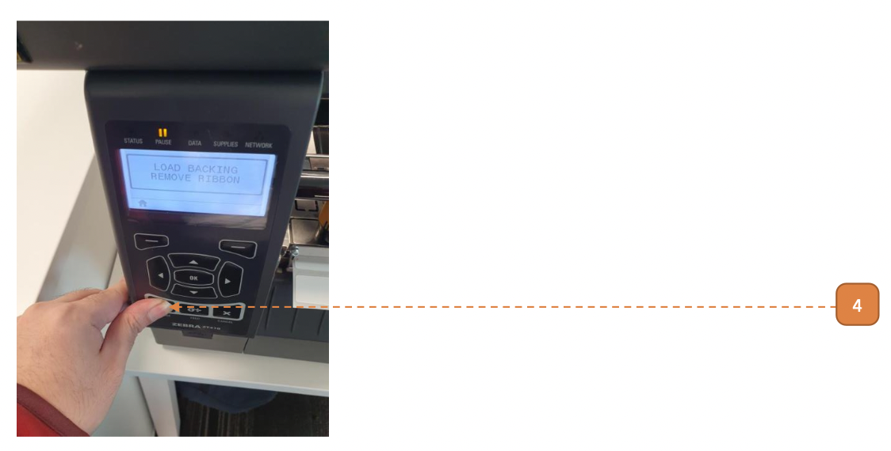
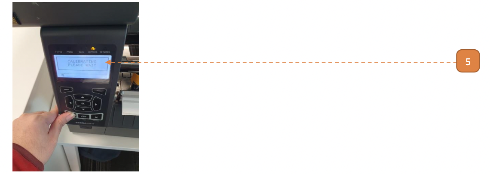
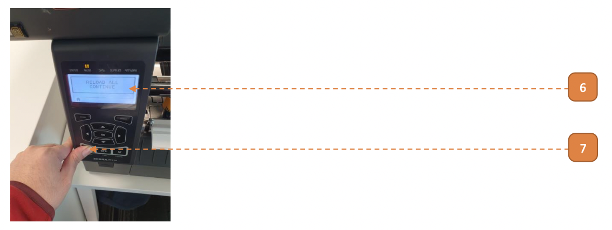
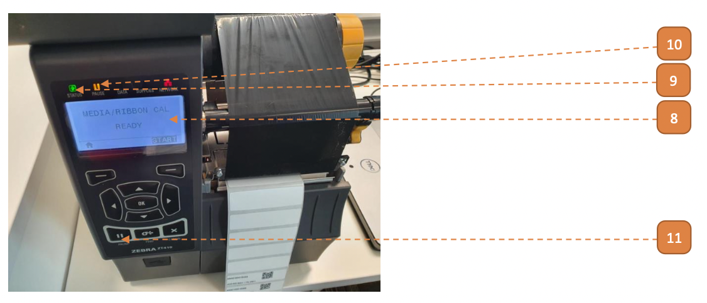

# Perform Media Calibration

## How do I Perform Media Calibration?

**Prerequisites:** Please complete [Load/Reload Media & Ribbon](410Load) before you begin.

1. Under the control panel, navigate to **SENSORS > MEDIA/RIBBON CAL**. Select button to **START**.

2. Note the **"LOAD BACKING REMOVE RIBBON"** message.

3. Twist the Printhead Lever to open the Printhead Assembly. Pinch the ribbon very tightly. Twist the Printhead Leaver to close the Printhead Assembly.

4. Select **Pause** button.

5. Note the **"CALIBRATING PLEASE WAIT"** message (this is briefly flashed).

6. Note the **"RELOAD ALL CONTINUE"** message.

7. Select **Pause** button.

Printer will begin the media calibration process.
Note the high-pitched whining sound as the tags are spooled by the printer.
These tages will be rewound at a later stage.
This process will take 1-2 minutes.

8. Once the spooling action stops, note the **"MEDIA/RIBBON CAL READY"** message.
- In some cases where media calibration may fail, please restart from **Step 1**.

9. Status indicator should be **green**.
- In the case where status indicator is red, please restart from **Step 1**.

10. Pause indicator should be lit.

11. Refer to [Feeding](411Feeding) to perform "feeding".

12. Once "feeding" is complete, refer to [RFID Calibration](410RFIDCali).