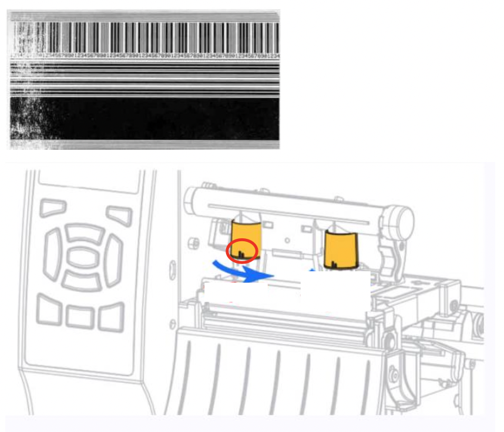
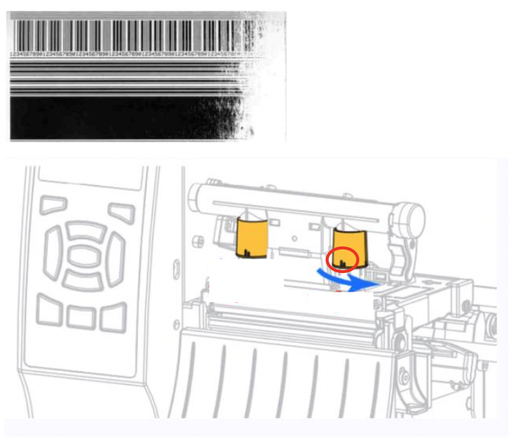

# Printing is faded on one side

Typical print fading will appear as such:

## Left faded

For left faded tags, turn **left** toggle **anticlockwise** to increase the printhead pressure.

Marker indicates reference printhead pressure from 1 to 4.
Market in this example is 2 (2 lines in circle below).
Refer to your printer's marker to get the reference pressure.

- If current marker is **1**, twist to **2**.
- If current marker is **2**, twist to **3**.
- If current marker is **3**, twist to **4**.
- If current marker is **4**, twist to **1**.

## Right faded 

For left faded tags, turn **right** toggle **anticlockwise** to increase the printhead pressure.

Marker indicates reference printhead pressure from 1 to 4.
Market in this example is 2 (2 lines in circle below).
Refer to your printer's marker to get the reference pressure.

- If current marker is **1**, twist to **2**.
- If current marker is **2**, twist to **3**.
- If current marker is **3**, twist to **4**.
- If current marker is **4**, twist to **1**.

