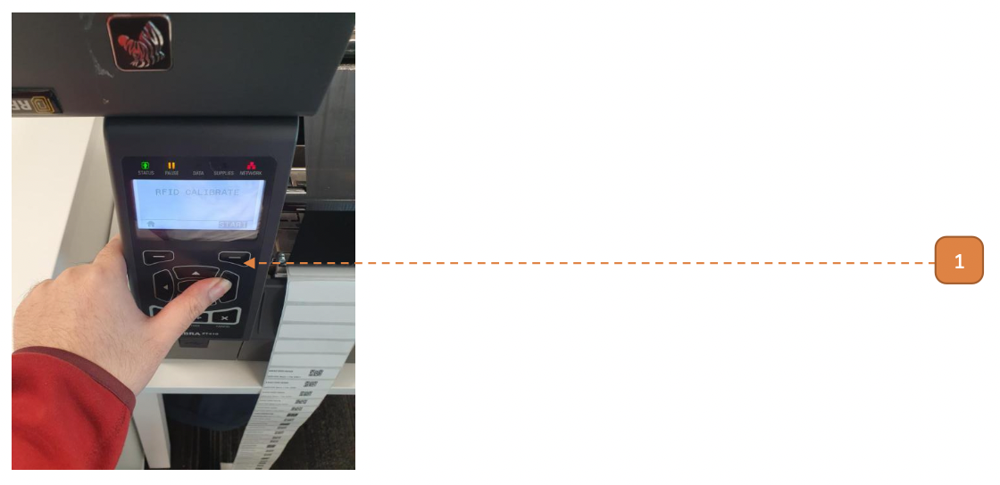
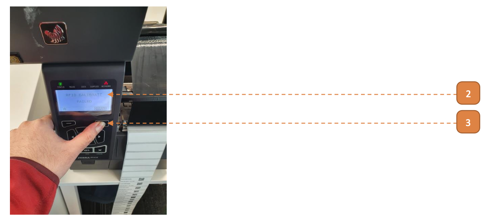

# Perform RFID Calibration

## How do I Perform RFID Calibration?

**Prerequisites:** Please complete [Feeding](410Feeding) before you begin.

1. Under the control panel, navigate to **NETWORK > RFID CALIBRATE**.
Select button (**refer to arrow**) to **START**.

2. In some cases, **"RFID CALIBRATE FAILED"** message will appear.

3. [Skip this step if you do not encounter **"RFID CALIBRATE MESSAGE"**] Select button to **START**.

4. Printer will begin with RFID Calibration process.
Note small mechanical sounds, this process will take a few minutes.
-  IF **"RFID CALIBRATE FAILED"** message appears, repeat **Step 3**.
If the **"RFID CALIBRATE FAILED"** message appears once again, please restart from [Media Calibration](410MediaCali).

5. Control panel display will revert back to RFID Calibration start screen, this indicates that RFID Calibration has passed, perform [Test Printing](410TestPrint).