# Perform Media Calibration

## How do I Perform Media Calibration?

**Prerequisites:** Please complete [Load/Reload Media & Ribbon](411Load) before you begin.

1. Under the Home page, tap **Wizards**.

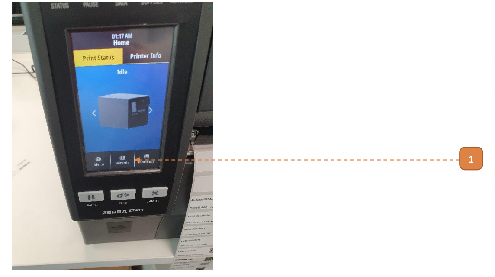

2. Tap **Print**.

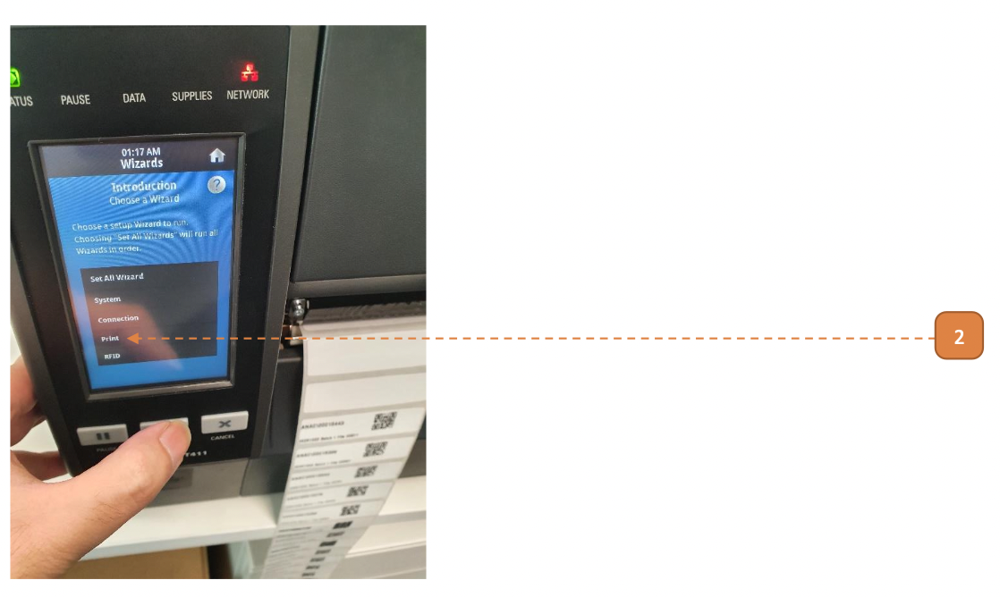

3. Tap **Start Print**.

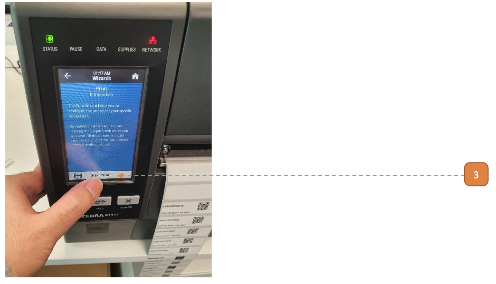

4. Check that **"Thermal Transfer"** is selected, tap ** “✓”**.

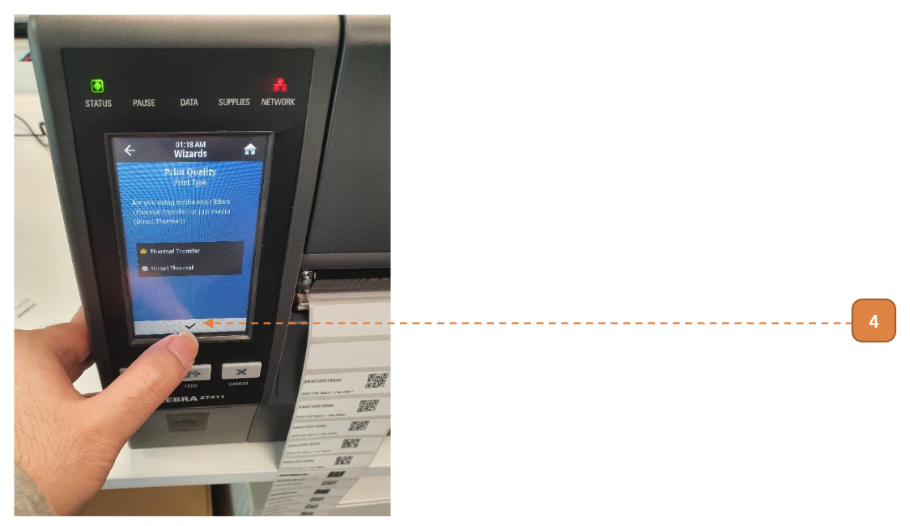

5. Check that **"Gap/Notch"** is selected, tap ** “✓”**.

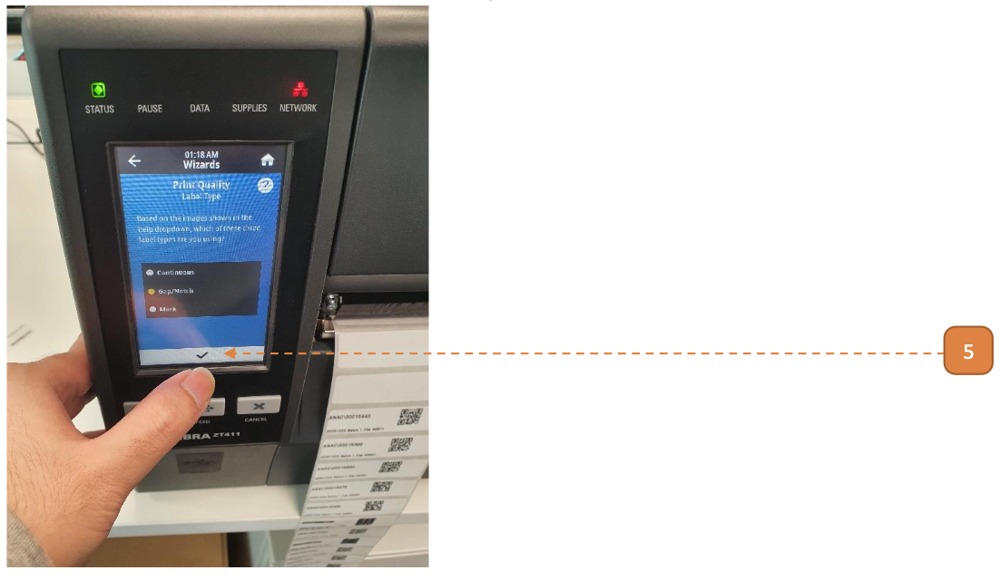

6. Tap **"✓”**, the value does not matter.

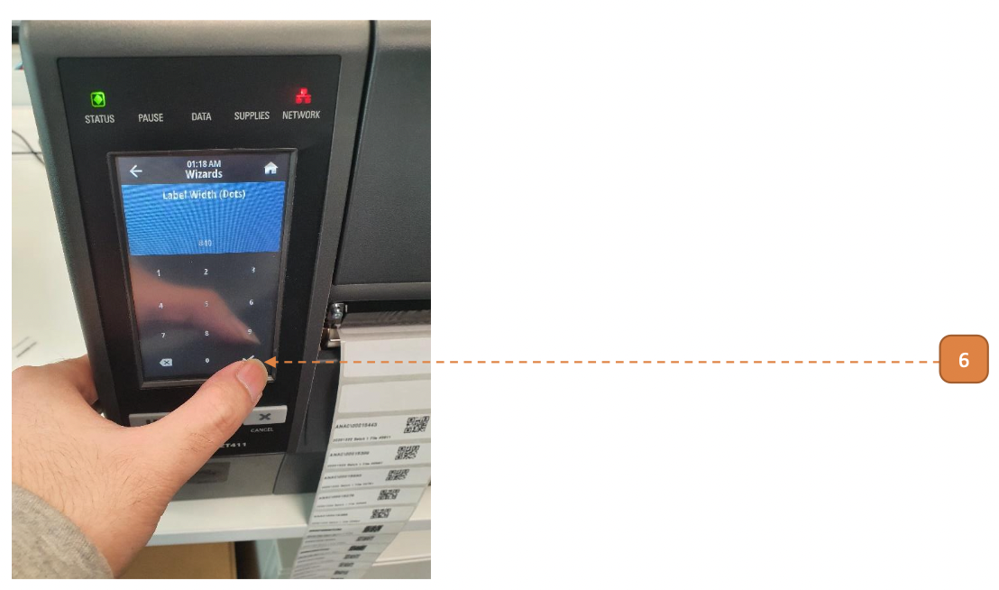

7. Check that **"Tear Off"** is selected, tap ** “✓”**.

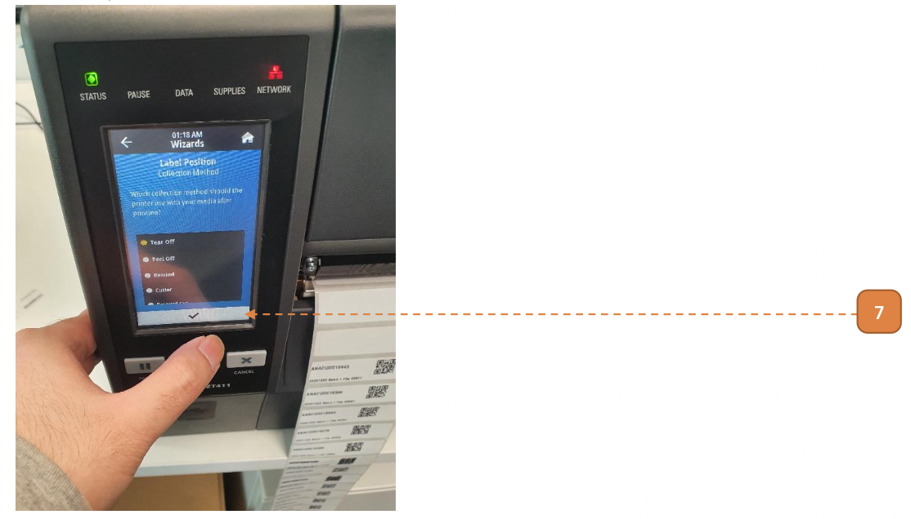

8. Tap ** “✓”**.

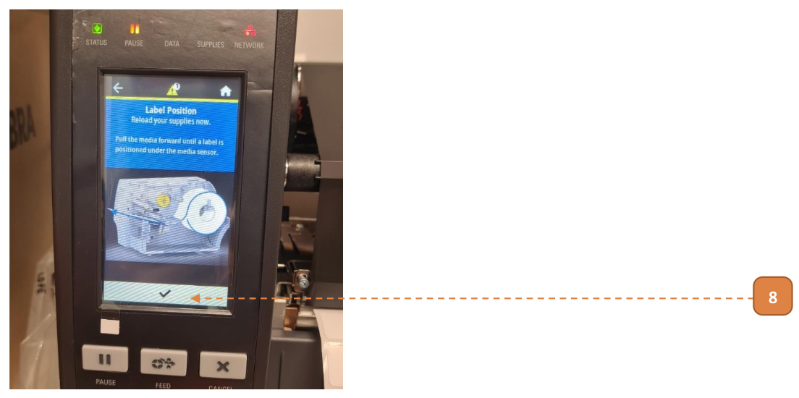

9. Tap ** “✓”**.

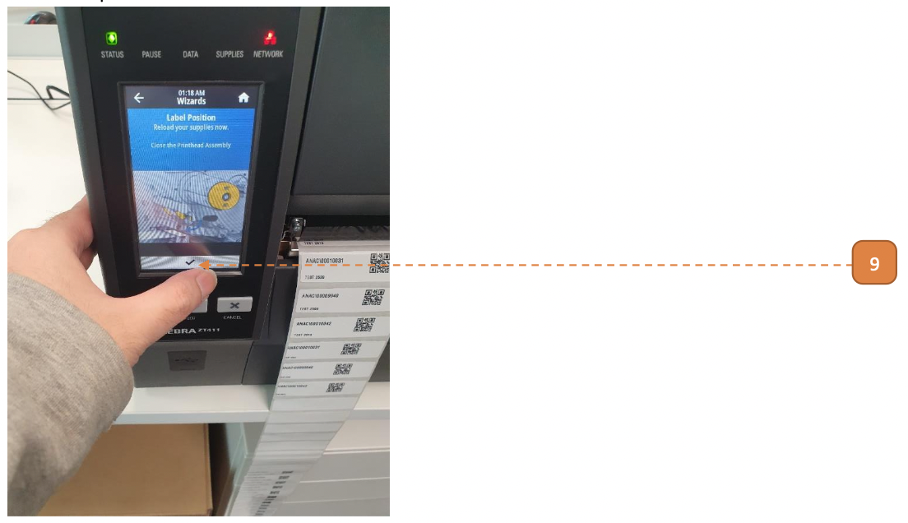

Printer will begin the media calibration process.
Note the high-pitched whining sound as the tags are spooled by the printer.
These tages will be rewound at a later stage.
This process will take 1-2 minutes.

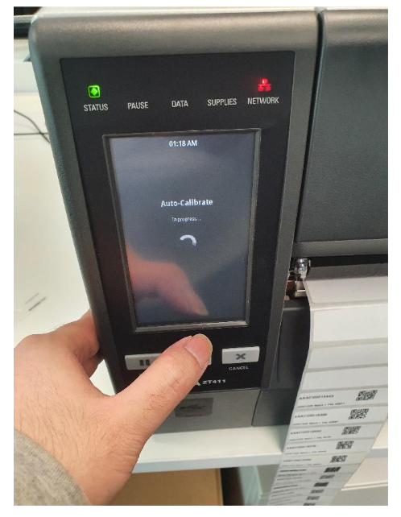

10. Once the spooling action stops, note the **"Auto-Calibrate Complete"** message.
- In some cases where media calibration may fail, please restart from **Step 1**.

On Success, tap **"X"**.

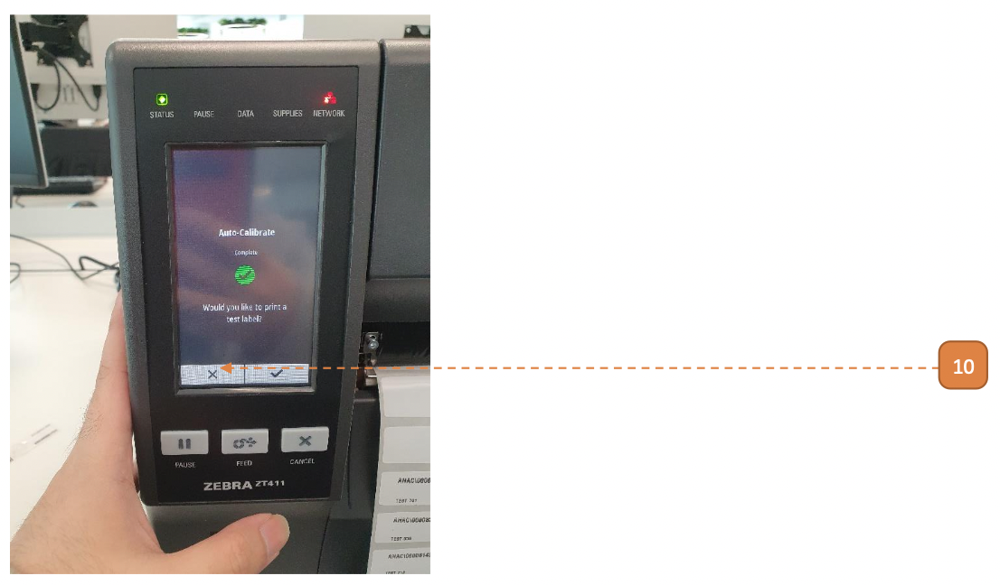

11. Check that the value is **0**, tap **“✓”**.

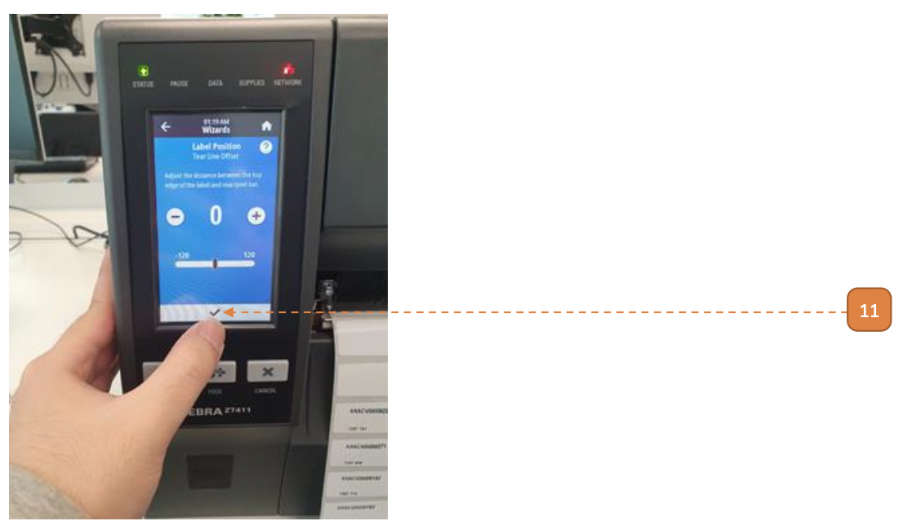

12. Tap **"Set Manually"**.

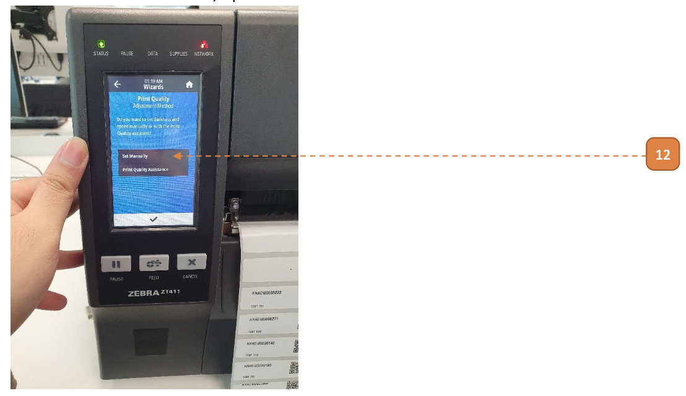

13. Tap **"Darkness"**.

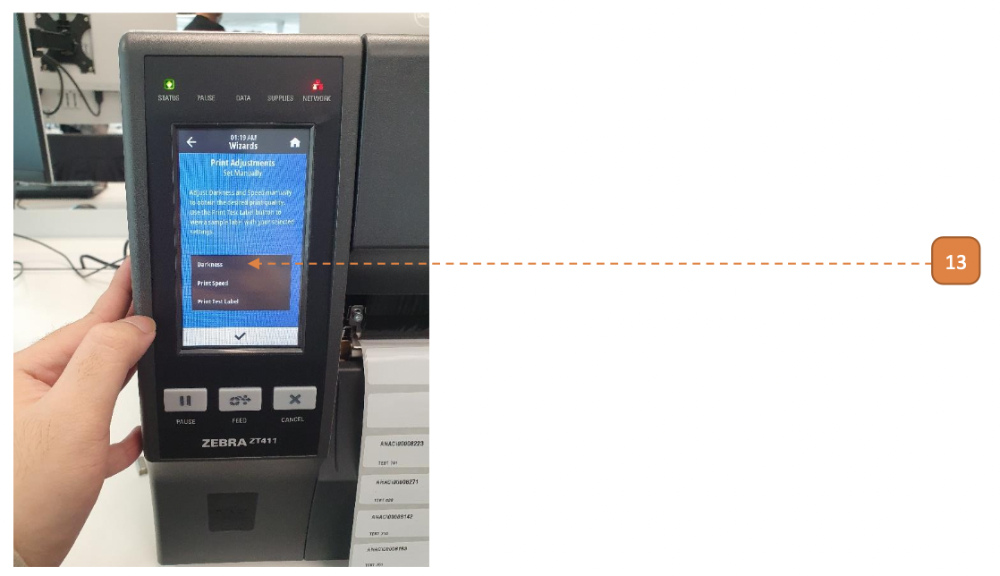

14. Set to **"30"**.

15. Tap **“✓”**.

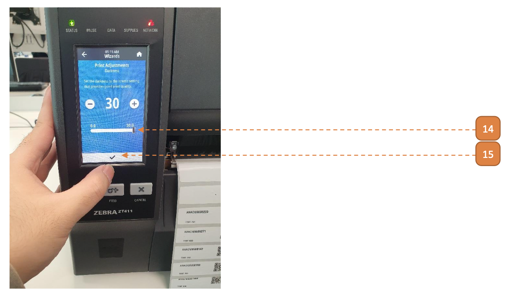

16. Tap **"Print Speed"**.

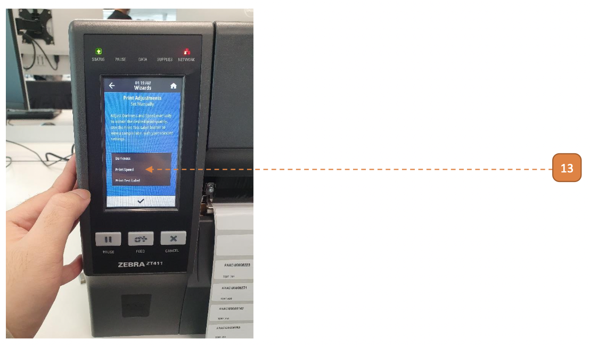

17. Set to **"2"**.

18. Tap **“✓”**.

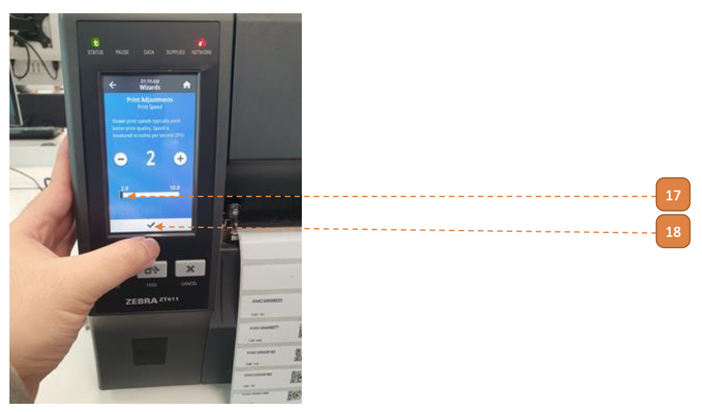

19. Tap **“✓”**.

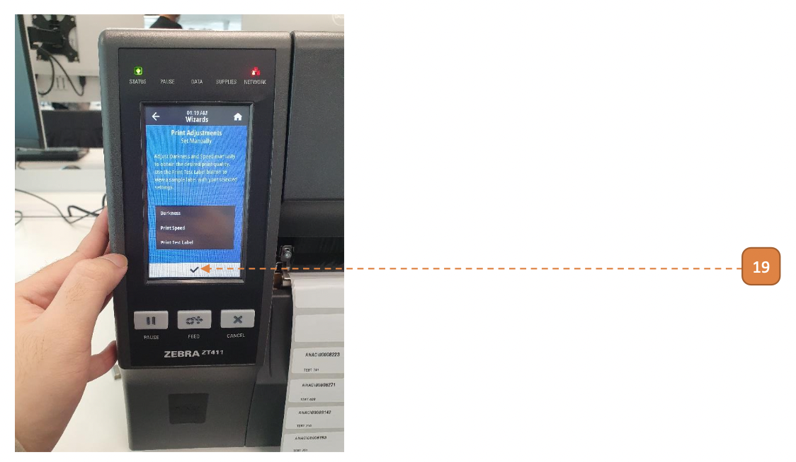

Media calibration is complete.

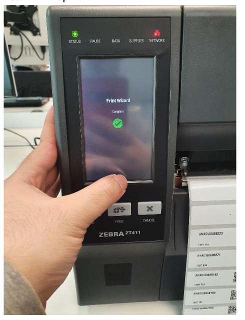