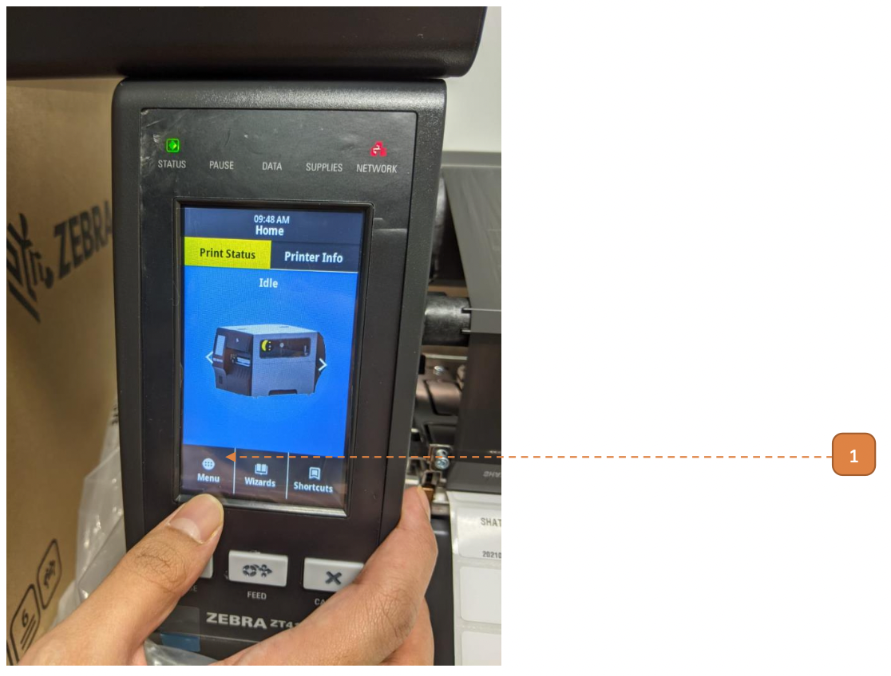
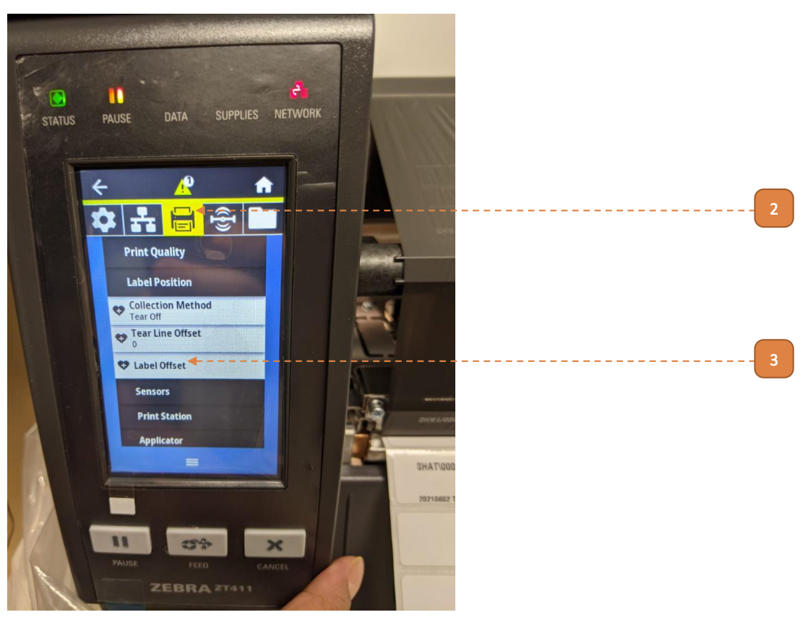
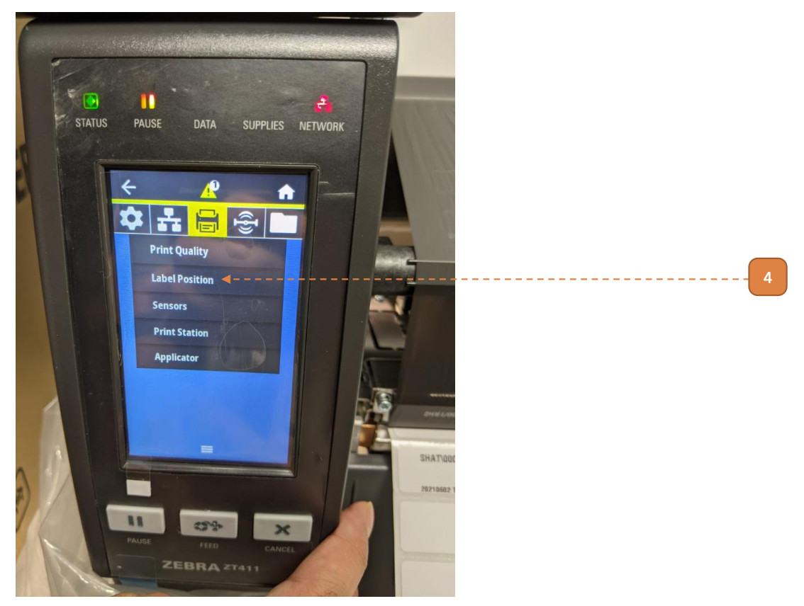
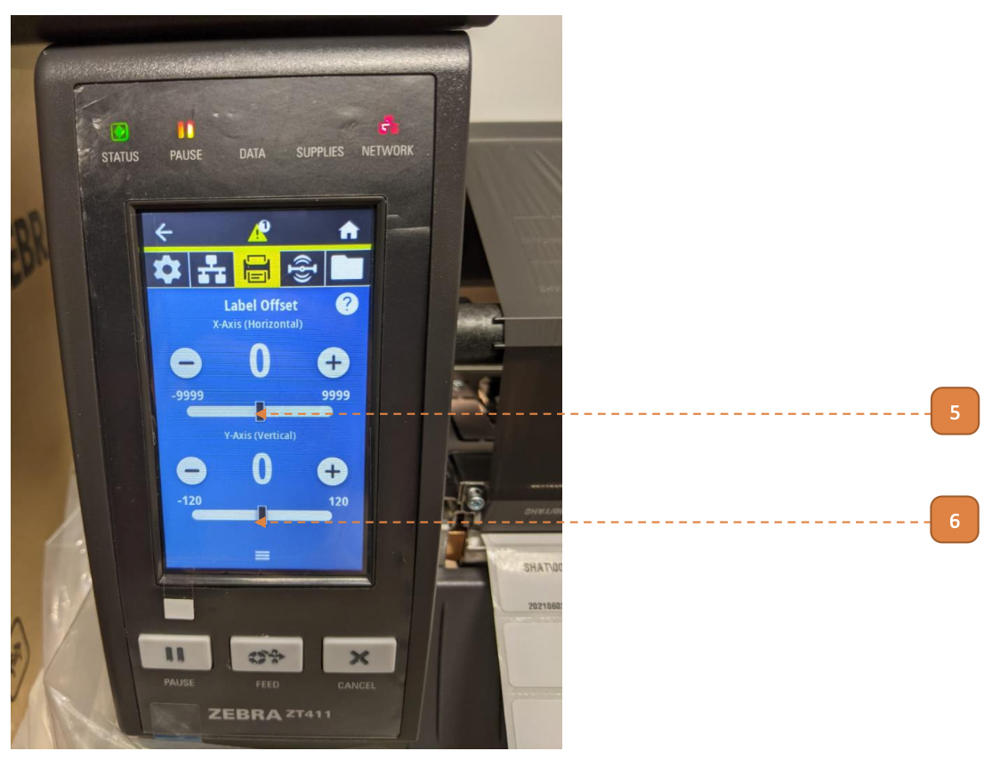

# Offset Print Position

## How do I Offset Print Position?

1. Tap **"Menu"**.

2. Tap Print icon.

3. Tap **"Label Offset"**.

4. Tap **"Label Position"**.

Adjust the value, start with value of 10 and try printing again. Fine tune the value to taste.

5. [Applicable for left-right alignment only] Negative value to shift printing right, positive to shift printing left.

6. [Applicable for top-down alignment only] Negative value to shift printing up, positive to shift printing down.

