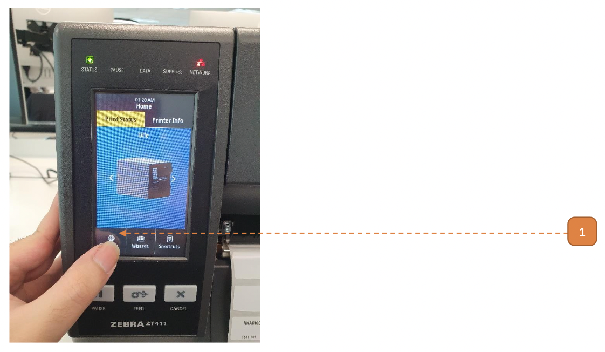
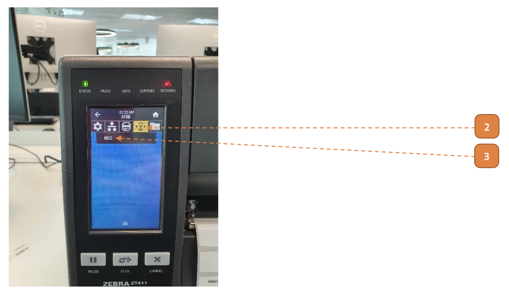
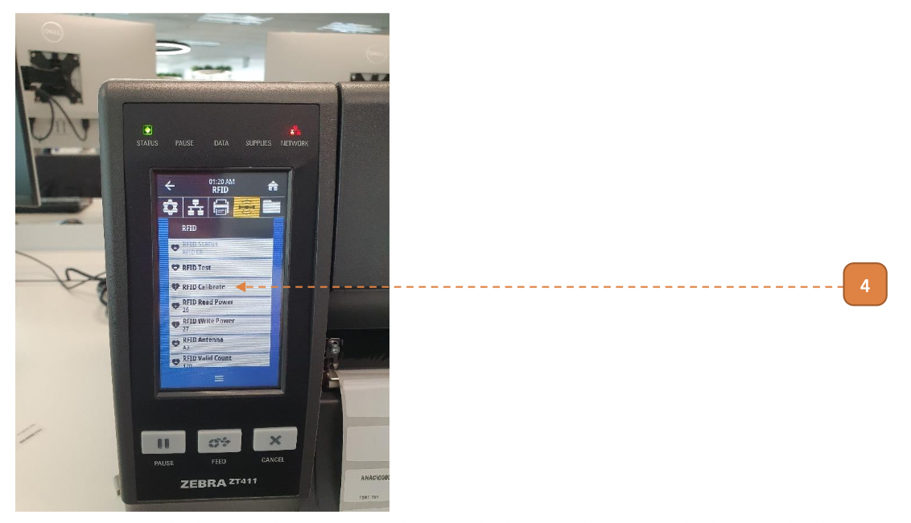
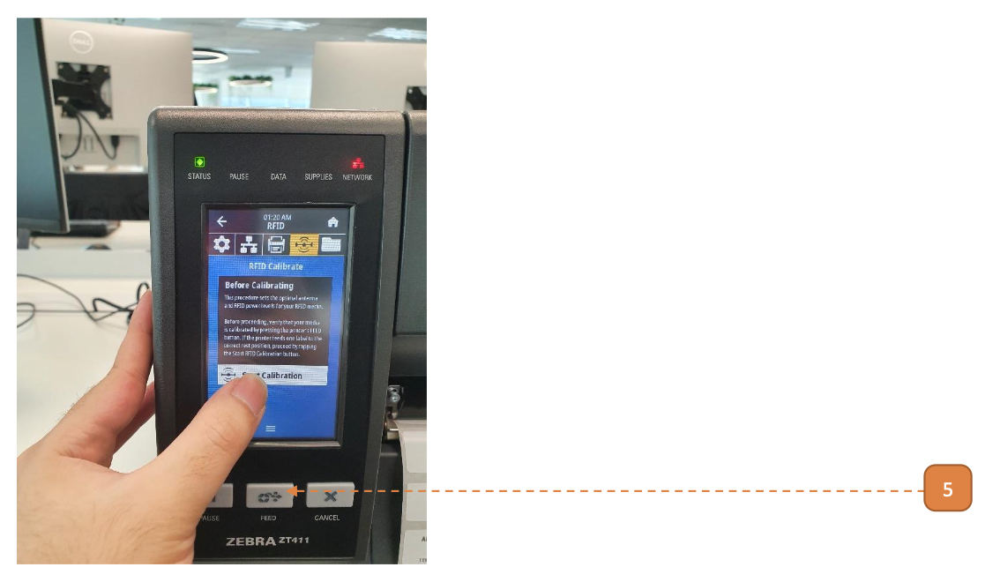
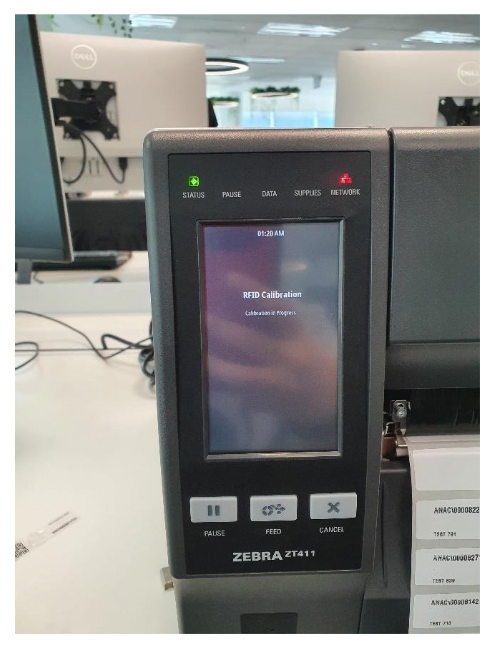
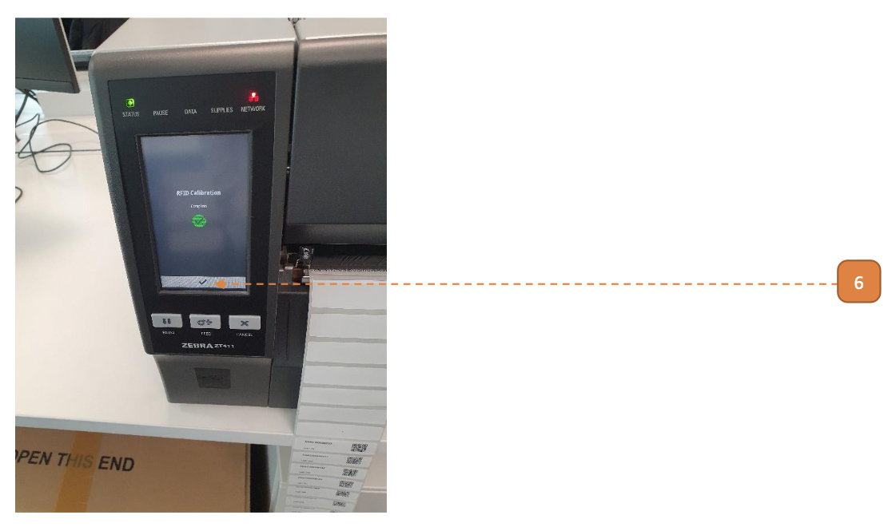

# RFID Calibration

## How do I Perform RFID Calibration?

**Prerequisites:** Please complete [Feeding](411Feeding) before you begin.

1. Tap **Menu**.

2. Tap Radio icon.

3. Tap **"RFID"**.

4. Tap **"RFID Calibrate"**.

5. Tap **"Start Calibration"**.

Printer will begin the RFID calibration process.
Note small mechanical sounds, this process will take a few minutes.
- In some cases where RFID calibration fails, please check [How to Rectify RFID Calibration Fail](411Rectify).

RFID calibration is complete.

6. Tap **“✓”**.

