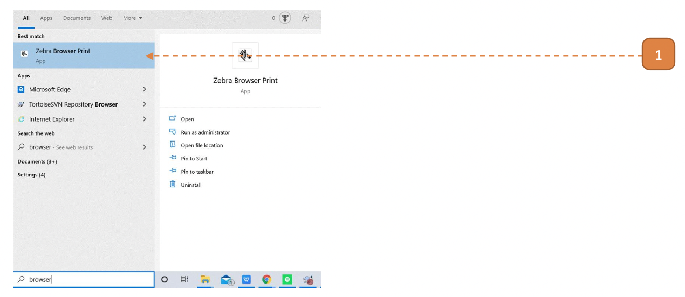
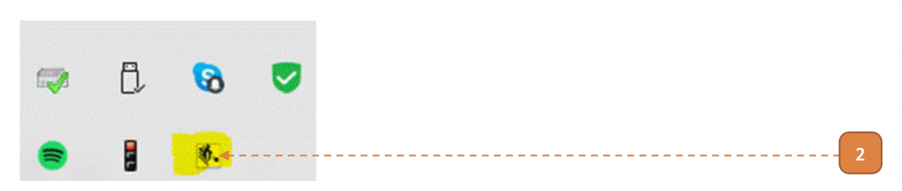
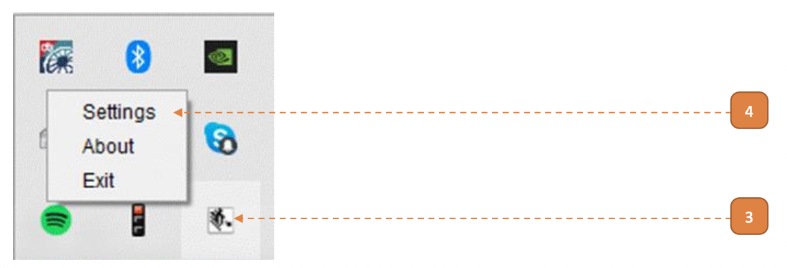
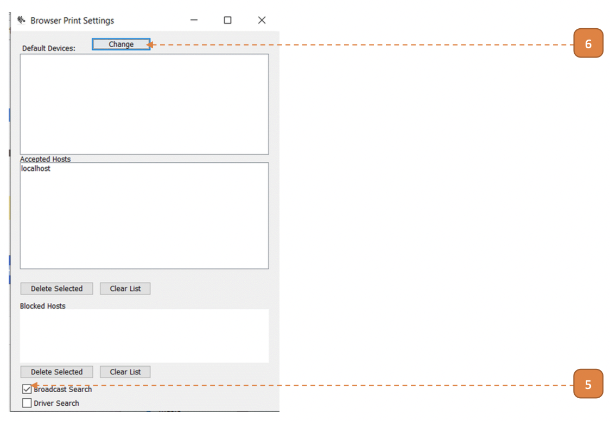
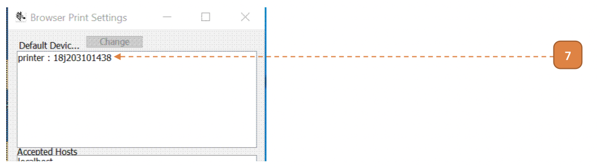
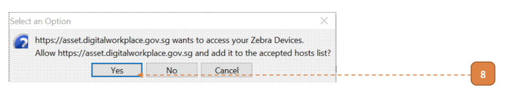

# All Printer Models

## How do I Setup the Printer Driver?

**Prerequisites:**
- **"Zebra Browser Print"** is installed
    - **"Zebra Browser Print"** is an ".exe" file, depending on agency software, clearance may be required
    - Please request the download URL with your onboarding facilitator

- Chromium or Chromium Edge browser is installed
- SOE computer is physically connected to the printer via USB
- Printer is switched on

1. Run the driver.
Go to windows start menu and search for **"Zebra Browser Print"**.
Select the tile.

- If the result above cannot be found, **"Zebra Browser Print"** is not installed. 
Refer to prerequesites above.

2. Under the windows hidden icon tray, confirm that **"Zebra Browser Print"** is running.

3. Right click on the icon.

4. Select **Settings**.

5. A window will appear.
Ensure **Broadcast Search** is selected.

6. Select the **Change*** button.
- Select the only option and click **OK**.
    - If "No Zebra Devices Found", please connect/reconnect your printer and ensure that printer is on.

7. The printer name should appear as shown below:

8. Open Chromium or Chromium Edge browser.
If this is the first time the SOE computer is being configured, the message below will show.
Select the **Yes** button.

